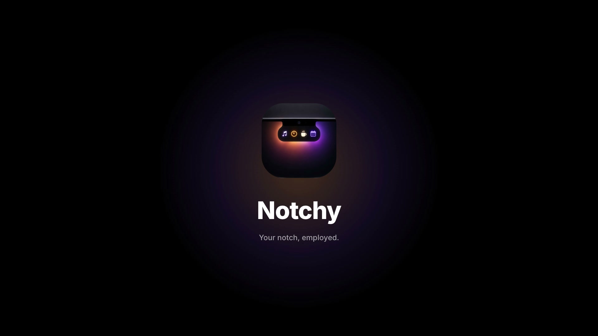

<p align="center">
  
</p>

<p align="center">
  <b>Transforme o notch do seu MacBook num painel útil.</b><br>
  Música, agenda, timer, prateleira de arquivos, espelho da webcam e mais — tudo a um passar de mouse.
</p>

<p align="center">
  
  
  
</p>

> 🇺🇸 **Notchy** turns your MacBook's notch into a handy panel: music controls, calendar with meeting alerts, focus timer, file shelf with AirDrop, webcam mirror, keyboard lock for cleaning, and caffeine mode. Free and open source. The interface is in Brazilian Portuguese.

---

## ✨ O que ele faz

Passe o mouse no notch e ele se abre. Tire o mouse e ele volta a ser só um notch.

| Módulo | O que faz |
| --- | --- |
| 🏠 **Início** | Mini-painel com até 3 widgets à sua escolha |
| 🎵 **Música** | Capa, faixa e controles do **Spotify** e do **Apple Music** |
| 📅 **Calendário** | Compromissos de hoje e amanhã. **Avisa 5 min antes da reunião** no notch fechado e mostra um botão **Entrar** para links do Meet, Zoom, Teams, Webex e FaceTime |
| ⏱️ **Timer** | Timer de foco (5, 15, 25, 45 min) com aviso sonoro |
| 🗂️ **Arquivos** | Prateleira para arrastar arquivos entre janelas e apps. Fica salva entre reinícios e envia por **AirDrop** |
| 📷 **Câmera** | Espelho rápido da webcam, sem abrir o FaceTime. Só liga quando você aperta o botão |
| ⌨️ **Teclado** | Trava o teclado para você limpar sem digitar nada. Destrava sozinho em 60 s |
| ☕ **Cafeína** | Impede o Mac de dormir (sem limite, 30 min, 1 h ou 2 h) |
| 🔋 **Bateria** | Porcentagem no topo e tempo restante ao passar o mouse. Avisa ao ligar/desligar o carregador |

E também:

- **Notch fechado inteligente** — mostra o timer rodando, a música tocando, a reunião chegando ou quantos arquivos estão na prateleira.
- **Tudo configurável** — ligue e desligue módulos e escolha os widgets da Início em ⚙️ Configurações.
- **Some em tela cheia** — não atrapalha vídeos e apps em tela cheia (dá para desativar).
- **Abre com o Mac**, tem toque háptico no trackpad e se adapta ao tamanho do seu notch.
- **Leve e nativo** — Swift + SwiftUI, sem Electron, sem conta, sem internet, sem coleta de dados.

## 📦 Instalação

### Opção 1 — Um comando (recomendado)

Abra o **Terminal** e cole:

```bash
curl -fsSL https://raw.githubusercontent.com/lucassteffenon/notchy/main/scripts/install.sh | bash
```

Ele baixa a última versão, instala em **Aplicativos** e abre o Notchy.

### Opção 2 — Baixar o app

1. Baixe o **`Notchy.zip`** na página de [**Releases**](https://github.com/lucassteffenon/notchy/releases/latest).
2. Descompacte e arraste o **Notchy** para a pasta **Aplicativos**.
3. Abra o Notchy. Como o app não é notarizado pela Apple, o macOS vai bloquear da primeira vez:
   vá em **Ajustes do Sistema → Privacidade e Segurança**, role até o fim e clique em **Abrir Mesmo Assim**.

   Ou, no Terminal:

   ```bash
   xattr -dr com.apple.quarantine /Applications/Notchy.app
   ```

### Opção 3 — Compilar o código

Precisa só das ferramentas de linha de comando da Apple (não precisa abrir o Xcode):

```bash
xcode-select --install
git clone https://github.com/lucassteffenon/notchy.git
cd notchy
./scripts/build.sh
```

O script compila, instala em **Aplicativos** e abre o app.

### Requisitos

- macOS 14 (Sonoma) ou mais novo
- Feito para MacBooks com notch. Em Macs sem notch ele funciona como uma barrinha no topo da tela.

## 🔐 Permissões

O Notchy só pede cada permissão quando você usa o módulo correspondente:

| Permissão | Para quê |
| --- | --- |
| **Acessibilidade** | Travar o teclado |
| **Câmera** | Espelho da webcam |
| **Calendários** | Mostrar a agenda e avisar das reuniões |
| **Automação** (Spotify / Música) | Ler a faixa atual e controlar a música |

Nada sai do seu Mac.

## 💡 Dicas

- **Arraste um arquivo até o notch** e ele abre direto na prateleira.
- **Arraste da prateleira** para qualquer app, ou solte em cima do botão **AirDrop**.
- **Clique direito** num arquivo da prateleira para mostrar no Finder ou enviar por AirDrop.
- Em **⚙️ → Início**, arraste os widgets para mudar a ordem.
- Para fechar o app: **⚙️ → Geral → Sair do Notchy**.

## 🛠️ Problemas comuns

<details>
<summary><b>Ativei a Acessibilidade, mas o teclado não trava</b></summary>

Em **Ajustes do Sistema → Privacidade e Segurança → Acessibilidade**, selecione o Notchy, remova-o com o botão **–**, e depois tente travar o teclado de novo para ele pedir a permissão outra vez. Se ainda não funcionar, feche e abra o Notchy.

Isso acontece quando você compila o app de novo: sem um certificado de desenvolvedor, cada build tem uma assinatura diferente e o macOS trata como outro app.
</details>

<details>
<summary><b>A música não aparece</b></summary>

Por enquanto o Notchy funciona com o **Spotify** e o **Apple Music** (app). Na primeira vez, aceite o pedido de **Automação**. Se negou sem querer, ative em **Ajustes do Sistema → Privacidade e Segurança → Automação**.
</details>

<details>
<summary><b>"O Notchy não pode ser aberto"</b></summary>

O app não é notarizado pela Apple. Veja a **Opção 2** da instalação, ou use a **Opção 1**, que já resolve isso.
</details>

## 🧑‍💻 Desenvolvimento

O projeto é Swift puro, compilado com `swiftc` (sem projeto do Xcode):

```
src/
├── main.swift             # Ponto de entrada
├── NotchController.swift  # Painel sobre o notch, mouse, abrir/fechar
├── NotchModel.swift       # Estado central, prateleira, bloqueio do teclado
├── NotchViews.swift       # Notch aberto/fechado, música, prateleira, AirDrop
├── HomeViews.swift        # Widgets da Início
├── SettingsViews.swift    # Configurações e Cafeína
├── ToolViews.swift        # Bateria, calendário e timer
├── Settings.swift         # Módulos e preferências salvas
└── …                      # Câmera, música, bateria, calendário, timer, cafeína, teclado
scripts/
├── build.sh               # Compila (universal), assina, instala e abre
├── release.sh             # Gera build/Notchy.zip para um release
└── install.sh             # Instalador de um comando
```

- `./scripts/build.sh` — compila e instala. Use `ARCHS=arm64` para compilar mais rápido só para Apple Silicon.
- `./scripts/release.sh` — gera `build/Notchy.zip` para anexar num release do GitHub.

Se você tiver um certificado **Apple Development** no Keychain, o build usa ele automaticamente, e o macOS lembra das permissões entre um build e outro.

## 🤝 Contribuindo

Ideias, bugs e pull requests são muito bem-vindos! Abra uma [issue](https://github.com/lucassteffenon/notchy/issues) para contar o que encontrou ou o que gostaria de ver.

## 📄 Licença

[MIT](LICENSE) — use, modifique e distribua à vontade.
